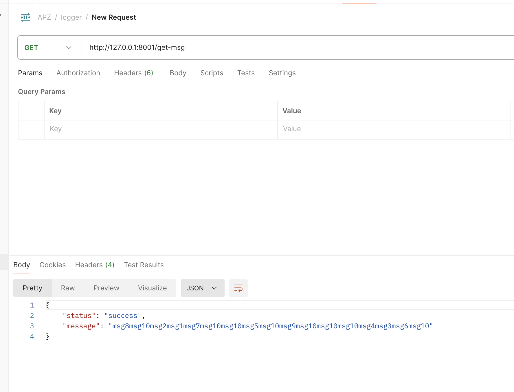

# Lab#5

## Description
First we create Kafka topic with two partitions for each of our message service:

`bin/kafka-topics.sh --create --topic apz-messages --bootstrap-server localhost:9092 --replication-factor 1 --partitions 2`

## How to run
Firts: `cd lab5` \b

Before running a service, make sure to change a value of `service_port` inside correxponding service. This is no a good practive but since the goal of this homework was to get familiar with Consul so this approach should do it's job.

To run facade service:
-  `python3 -m uvicorn facade.api.facade_controller:app --port 8000 `

To run logging service:
- `python3 -m uvicorn mylogging.api.logging_controller:app --port 8001`

For logging service I am using ports from 8001 to 8003

To run message service:
- `python3 -m uvicorn messages.api.messages_controller:app --port 8004`

For message service I am using ports from 8004, 8005

As a client I've used Postman

## Demo

Services running in Consul

Consul key value

Get messages using facade

Messages from messages service from kafka (same from 2 different serivces. Check port numbers on screenshots)

Messages are the same from 3 different logger services (thnx hazelcast)

